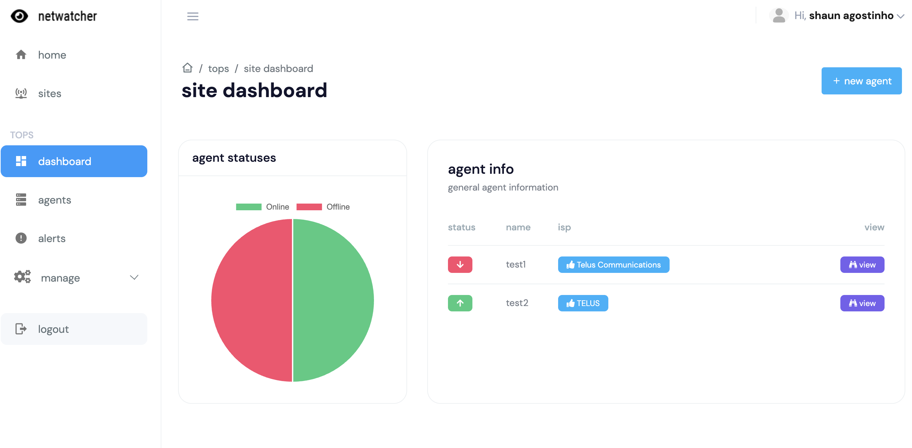
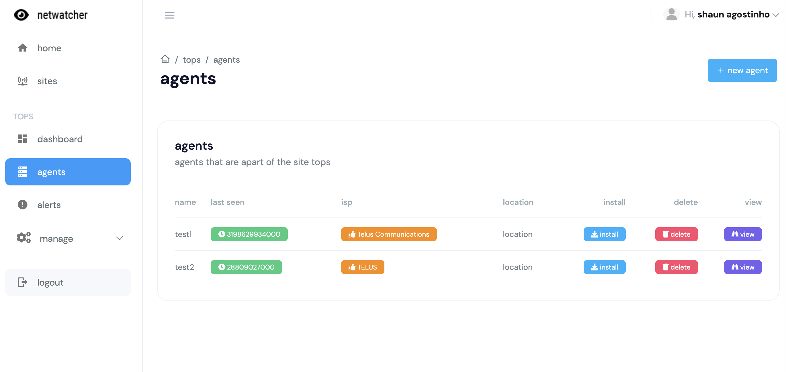
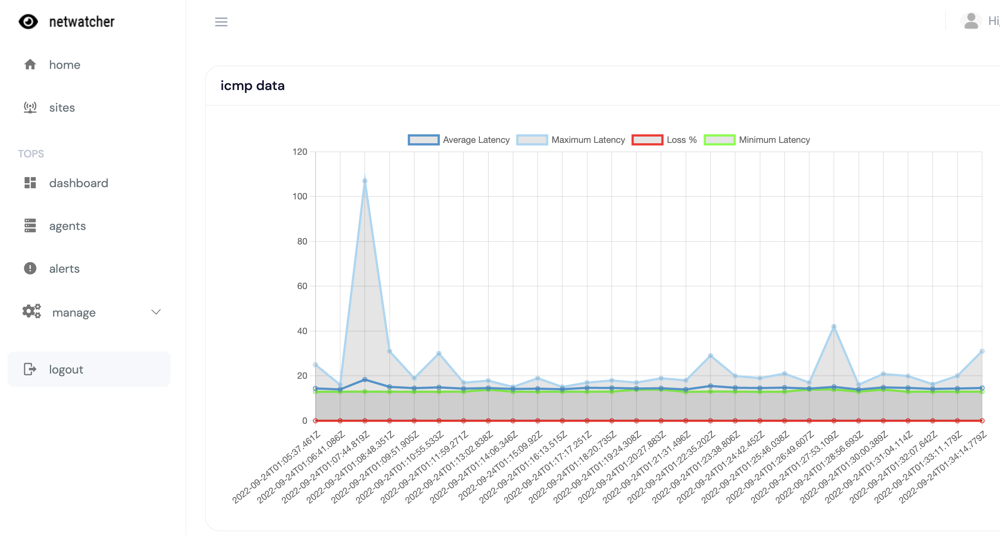

## This is still a WIP

# Netwatcher Control

### Description

Netwatcher is a work in progress. It is a simple network monitoring tool, designed for MSPs, and other service providers. The goal is to have a simple platform that is able to monitor various metrics such as latency, bandwidth, network maps, and packet loss. With this tool, you will be able to monitor all aspects of a VoIP supporting network, and to help troubleshoot common voice issues.

### This is still a WIP

### Screenshots

### Installation

TODO

### Usage

TODO
